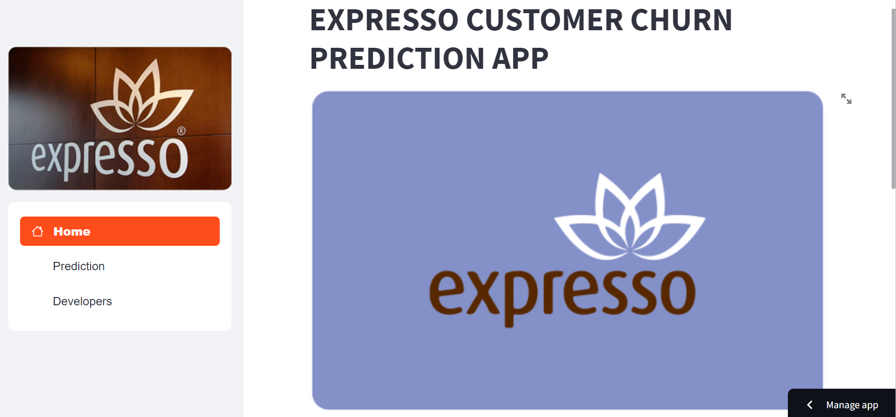

# EXPRESSO CUSTOMER CHURN PREDICTION

## PROJECT DESCRIPTION
This project is for an African telecommunications company that provides customers with airtime and mobile data bundles. The objective of this project is to develop a machine learning model to predict the likelihood of each customer “churning,” i.e. becoming inactive and not making any transactions for 90 days.

This solution will help this telecom company to better serve their customers by understanding which customers are at risk of leaving.

## SUMMARY
| Code      | Name        | Published Article |  Deployed App |
|-----------|-------------|:-------------|:------|
|CP         | EXPRESSO CUSTOMER CHURN PREDICTION  |           | [STREAMLIT](https://teamzurich.streamlit.app/) [HUGGING FACE]|

# NOTES ON DATASETS
The complete dataset  can be found and downloaded from Zindi: [Zindi Churn Challenge](https://zindi.africa/competitions/customer-churn-prediction-challenge-for-azubian)
 

**Train data :** Contains information about 1 million customers. There is a column called CHURN that indicates if a client churned or not. This is the target variable. You must estimate the likelihood that these clients churned. We will use this file to train our model.

**Test data :** This is similar to the train data but without the Churn column. We will use this file to test our model.

The dataset has 19 variables. Below are the definitions of variables found in the datasets: 
|VARAIABLE|DEFINITION|FEATURE|
|---------|----------|---------|
|`user_id`| A  unique identification number of a client|Numeric|
|`REGION` |The location of each client|Categorical|
|`TENURE` |Duration of the network usage|Numeric|
|`MONTANT` |The top-up amount|Numeric|
|`FREQUENCE_RECH`| The number of times the customer refilled|Numeric|
|`REVENUE`|The monthly income of each client|Numeric|
|`ARPU_SEGMENT`|Income over 90 days / 3|Numeric|
|`FREQUENCE`| The number of times the client has made an income|Numeric|
|`DATA_VOLUME`| The number of connections|Numeric|
|`ON_NET`|Inter Expresso calls|Numeric|
|`ORANGE`|calls to Orange network|Numeric|
|`TIGO`|calls to Tigo network|Numeric|
|`ZONE1`| calls to zones1|Numeric|
|`ZONE2`|calls to zones2|Numeric|
|`MRG`|a client who is going|Categorical|
|`REGULARITY`|The number of times the client is active for 90 days|Numeric|
|`TOP_PACK`|The most active packs|Categorical|
|`FREQ_TOP_PACK`|The number of times the client has activated the top pack packages|Numeric|
|`CHURN`| Whether a client still patronizes the network or not. This is the variable to predict (Target Variable)|Binary|

# SCREESHOTS OF DEPLOYED APP

# SETUP
It is recommended to have Virtual Studio Code or any other standard code editor on your local machine. Install the required packages locally to your computer.

It is recommended that you run a python version 3.0 and above. 
You can download the required python version from [here](https://www.python.org/downloads/).

Use these recommended steps to set up your local machine for this project:

1. **Clone the repo :** To clone this repo, copy the url and paste it in your GitHub desktop or code editor on your local machine.
        
        https://github.com/elvis-darko/Team_Zurich_Capstone_Project.git

1. **Create the Python's virtual environment :**  This will isolate the required libraries of the project to avoid conflicts. Choose any of the line of code that will work on your local machine.

            python3 -m venv venv
            python -m venv venv

2. **Activate the Python's virtual environment :** This will ensure that the Python kernel & libraries will be those of the created isolated environment.

            - for windows : 
                         venv\Scripts\activate

            - for Linux & MacOS :
                         source venv/bin/activate

3. **Upgrade Pip :** Pip is the installed libraries/packages manager. Upgrading Pip will give an to up-to-date version that will work correctly.

            python -m pip install --upgrade pip

4. **Install the required libraries/packages :** There are libraries and packages that are required for this project. These libraries and packages are listed in the `requirements.txt` file. The text file will allow you to import these libraries and packages into the python's scripts and notebooks without any issue.

            python -m pip install -r requirements.txt 

# MACHINE LEARNING MODEL DEPLOYMENT
## Run Streamlit App
A streamlit app was added for further exploration of the model. The streamlit app provides a simple Graphic User Interface where predicitons can be made from inputs.

- Run the demo app (being at the root of the repository):
        
        Streamlit run streamlit.app.py

## Run FastAPI

- Run the FastAPI apps (being at the repository root) on a terminal :
        
  FastAPI:
    
    - Demo

          uvicorn src.main.api:fastapi_app --reload 

# EVALUATION
The evaluation metric for this challenge is Area Under the Curve (AUC).

The values can be between 0 and 1, inclusive. Where 1 indicates the customer churned and 0 indicates the customer stayed with Expresso.

Our final work would look like this:

            user_id                                      CHURN
            00001dbe00e56fc4b1c1b65dda63de2a5ece55f9      0.98
            000055d41c8a62052dd426592e8a4a3342bf565d      0.12
            000081dd3245e6869a4a9c574c7050e7bb84c2c8      0.37

# RESOURCES
Here are some ressources you would read to have a good understanding of tools, packages and concepts used in the project:
- [FastAPI Tutorial - User Guide](https://fastapi.tiangolo.com/tutorial/)
- [Video - Building a Machine Learning API in 15 Minutes ](https://youtu.be/C82lT9cWQiA)
- [Video - Deploy ML models with FastAPI, Docker, and Heroku ](https://www.youtube.com/watch?v=h5wLuVDr0oc)
- [FastAPI Tutorial Series - videos](https://www.youtube.com/watch?v=tKL6wEqbyNs&list=PLShTCj6cbon9gK9AbDSxZbas1F6b6C_Mx)
- [Http status codes](https://www.linkedin.com/feed/update/urn:li:activity:7017027658400063488?utm_source=share&utm_medium=member_desktop)
- [Getting Started With Hugging Face in 15 Minutes](https://www.youtube.com/watch?v=QEaBAZQCtwE)
- Dockerize your Streamlit app to get it ready to be deployed to any cloud hub. [Watch this](https://www.youtube.com/watch?v=f6zJwK-pCJo)
- [Getting started with Hugging Face](https://huggingface.co/docs)
- [Getting started with Streamlit](https://docs.streamlit.io/library/get-started)

## CONTRIBUTORS
| NAME  |   COUNTRY |   E-MAIL  |
|:------|:----------|:----------|
|ELVIS DARKO|GHANA|elvis_darko@outlook.com|
|FAITH BERIDA|NIGERIA| princesstoy07@yahoo.com |
|RICHMOND E.Y. ABAKE|GHANA| richie.abake@gmail.com |
|RICHMOND TETTEH| GHANA|  |
|JOSEPH GIKUBU| KENYA|gikubujoseph@outlook.com|
|MARIE GRACE KAGAJU |  RWANDA |  kagajugrace@gmail.com |
